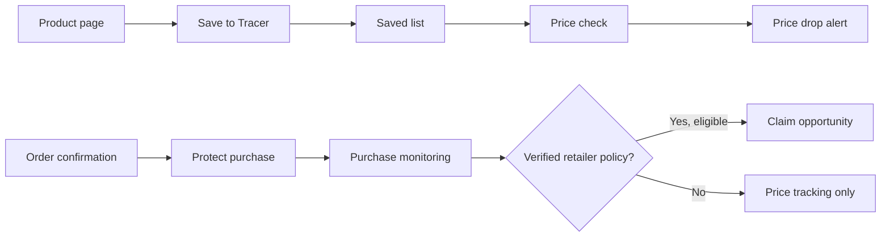

# Tracer

**Save a product now. Know when its price falls. Protect a purchase after checkout.**

Tracer is a Chrome extension and companion web app for tracking products across public online stores. Shoppers can save a product before buying it, see price changes in their Saved list, and protect a completed purchase. For protected purchases, Tracer checks later prices and surfaces a claim opportunity only when a verified retailer policy supports one.

This repository includes the extension, a React landing page, a Fastify API, shared TypeScript domain logic, deterministic monitoring fixtures, and a PostgreSQL schema. Local development uses a file store; the production API uses transactional PostgreSQL storage.

## At a glance

| | |
| --- | --- |
| **Product** | Chrome Manifest V3 extension, landing page, and purchase dashboard |
| **Stack** | TypeScript, React, Vite, Fastify, Vitest, Drizzle schema |
| **Focus** | Product extraction, price monitoring, safe URL handling, and policy-aware opportunities |
| **Storage** | Saved items in Chrome storage; protected purchases in a local file for development or PostgreSQL for production |

## What it does

- **Save before checkout.** Open Tracer on a supported product page to save its name, retailer, URL, optional image, and price. Saved items remain in the browser profile.
- **Watch for price drops.** The extension checks saved product prices and shows the current price, amount saved, and a notification when it detects a meaningful drop.
- **Protect after checkout.** On a supported order confirmation page, Tracer extracts structured purchase details locally and asks the shopper to confirm protection.
- **Separate tracking from claims.** A lower price is shown as a price drop; a refund or price-match opportunity appears only when a verified retailer policy and its eligibility window support it. John Lewis is the first policy adapter.
- **Handle uncertain pages conservatively.** Tracer rejects unsafe or ambiguous product URLs and does not invent prices or purchase details when a page lacks reliable evidence.



## Engineering highlights

**Shared rules across runtimes.** `packages/core` contains money and product models, extraction, URL validation, monitoring decisions, and policy evaluation. The extension and API use these rules rather than duplicating business logic.

**Evidence-based capture.** Retailer-specific adapters run first. Generic extraction falls back to schema.org order/product data and clear page signals. Product identity and same-store URLs are checked before data is saved or fetched.

**Two distinct customer states.** Saved products live locally in Chrome storage. Protected purchases enter the API monitoring flow after explicit confirmation. A saved price drop never becomes a claim opportunity by itself.

**Deterministic monitoring.** HTML fixtures exercise a purchase at its paid price and after a price drop. The same monitoring use case also supports live public product-page checks; fixtures make the core behavior reproducible without relying on a retailer site staying unchanged.

## Repository map

| Path | Responsibility |
| --- | --- |
| [`apps/extension`](apps/extension) | Popup, content scripts, saved-item monitor, notifications, and Chrome storage |
| [`apps/web`](apps/web) | React landing page and dashboard UI |
| [`apps/api`](apps/api) | Fastify endpoints, monitoring scheduler, and development/production repositories |
| [`packages/core`](packages/core) | Domain models, extraction, matching, policy, and monitoring use cases |
| [`packages/db`](packages/db) | Drizzle PostgreSQL schema and initial migration |
| [`docs`](docs) | Architecture and deeper monitoring notes |

## Run locally

### Requirements

- Node.js 26+ and npm 11+
- Google Chrome for the unpacked extension
- PostgreSQL only if you want to inspect or apply the included database migration; the local app uses a file-backed store

```bash
git clone https://github.com/osamaajr/tracer.git
cd tracer
npm install
cp .env.example .env
npm run dev
```

The API runs at `http://localhost:4000` and the web app at `http://localhost:5173`. The development store is `.tracer-data/dev-store.json` by default.

To load the extension:

```bash
npm run build -w @tracer/extension
```

Then open `chrome://extensions`, enable **Developer mode**, and choose **Load unpacked** with `apps/extension/dist`. Use **Reload** on the Tracer card after rebuilding. Keep `npm run dev` running for purchase protection and API-backed features.

### Try the customer flow

1. Open a public HTTPS product page with reliable product metadata, then click the Tracer toolbar icon and choose **Save to Tracer**.
2. Open **Your items → Saved** to see the saved product and its monitoring state.
3. For a repeatable purchase demo, open `http://127.0.0.1:5173/tracer-demo-order.html`, click Tracer, and choose **Protect this purchase**.
4. Run the paid and dropped fixture flow described in [`docs/v1-monitoring-workflow.md`](docs/v1-monitoring-workflow.md) to see a protected purchase move from watching to price dropped.

The local web server also serves development-only order and extension-state previews. They are excluded from production web builds.

## Quality checks

```bash
npm run typecheck
npm test
npm run lint
npm run build
```

Tests cover extraction, saved-item behavior, monitoring decisions, policy evaluation, and API routes using local fixtures.

## Current scope

- Product and order capture work best on public HTTPS pages with clear structured data or unambiguous page content. Private, heavily scripted, or bot-protected pages may not provide a checkable price.
- Saved items are local to one Chrome profile. Protected purchases use a random extension-installation token; account sync and recovery are not available.
- Production purchase persistence uses a transactional PostgreSQL JSONB state row. The normalized schema is not yet used by the API.
- John Lewis is the first verified policy adapter. Other stores can be tracked without implying a refund is available.
- The extension is loaded locally; it is not yet distributed through the Chrome Web Store.

For implementation detail, see [`docs/architecture.md`](docs/architecture.md), [`docs/universal-watchlist.md`](docs/universal-watchlist.md), and [`docs/v1-monitoring-workflow.md`](docs/v1-monitoring-workflow.md).

For the API hosting, domain, and customer extension release steps, see [`docs/production-deployment.md`](docs/production-deployment.md).
